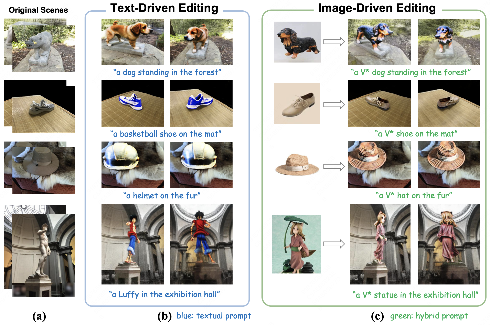
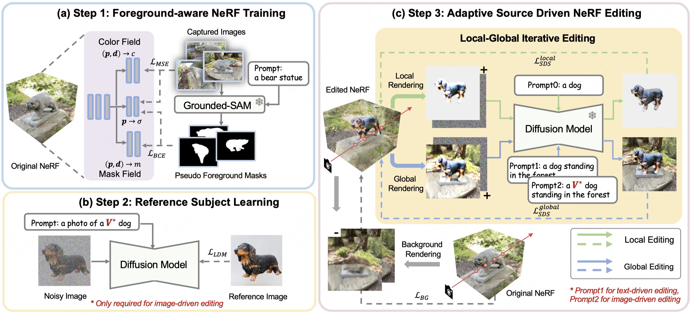

## <span style="text-decoration: underline"><font color="Tomato">Custom</font></span>ize your <span style="text-decoration: underline"><font color="Tomato">NeRF</font></span>: Adaptive Source Driven 3D Scene Editing via Local-Global Iterative Training

Pytorch implementation of [Customize your NeRF: Adaptive Source Driven 3D Scene Editing via **Local-Global Iterative Training**](https://arxiv.org/abs/2312.01663)

Runze He,
Shaofei Huang,
Xuecheng Nie,
Tianrui Hui,
Luoqi Liu,
Jiao Dai,
Jizhong Han,
Guanbin Li,
Si Liu

[](https://arxiv.org/abs/2312.01663)
[](https://customnerf.github.io/)

---

<div align="center">

<i> CustomNeRF unifies a text description or a reference image as the editing prompt for 3D scene editing. </i>
</div>


## Updates

<!-- - [2024/3/12] Code released. -->
- [2023/12/4] Paper is available [here](https://arxiv.org/abs/2312.01663).

---

## Introduction



In this paper, we target the adaptive source driven 3D scene editing task by proposing a CustomNeRF model that unifies a text description or a reference image as the editing prompt. However, obtaining desired editing results conformed with the editing prompt is nontrivial since there exist two significant challenges, including accurate editing of only foreground regions and multi-view consistency given a single-view reference image. 

To tackle the first challenge, we propose a Local-Global Iterative Editing (LGIE) training scheme that alternates between foreground region editing and full-image editing, aimed at foreground-only manipulation while preserving the background. 

For the second challenge, we also design a class-guided regularization that exploits class priors within the generation model to alleviate the inconsistency problem among different views in image-driven editing. Extensive experiments show that our CustomNeRF produces precise editing results under various real scenes for both text- and image-driven settings.

<!-- ## Usage -->

<!-- ### Requirements -->
<!-- We implement our method with [diffusers](https://github.com/huggingface/diffusers) code base with similar code structure to [Prompt-to-Prompt](https://github.com/google/prompt-to-prompt). The code runs on Python 3.8.5 with Pytorch 1.11. Conda environment is highly recommended. -->

<!-- ```base
pip install -r requirements.txt
``` -->

## Acknowledgements

We thank the awesome research works [Custom Diffusion](https://github.com/adobe-research/custom-diffusion), [torch-ngp](https://github.com/ashawkey/torch-ngp).


## Citation

```bibtex
@article{he2023customize,
      title={Customize your NeRF: Adaptive Source Driven 3D Scene Editing via Local-Global Iterative Training},
      author={He, Runze and Huang, Shaofei and Nie, Xuecheng and Hui, Tianrui and Liu, Luoqi and Dai, Jiao and Han, Jizhong and Li, Guanbin and Liu, Si},
      journal={arXiv preprint arXiv:2312.01663},
      year={2023}
}
```


## Contact

If you have any comments or questions, please [open a new issue](https://github.com/TencentARC/MasaCtrl/issues/new/choose) or feel free to contact [Runze He](https://github.com/hrz2000).